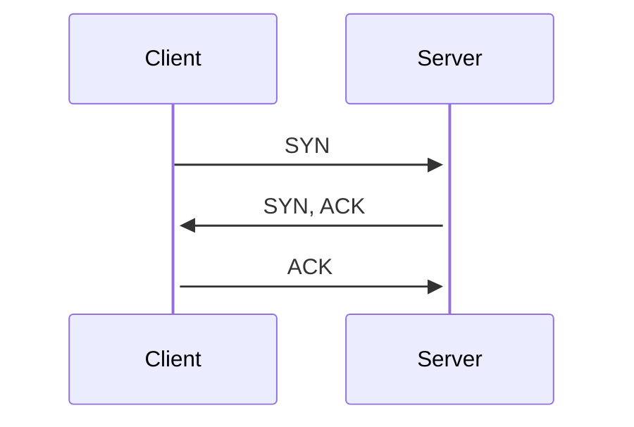

## TCP
A TCP connection is a reliable, established communication link between two devices on a network using TCP or ensure data is delivered accurately, completely and in the correct order.
(Simply: It is a procedure devices follow to talk with one another and is reliable.)

TCP connections are initialized with a three way handshake using specific TCP flags.
TCP Flags: https://www.geeksforgeeks.org/computer-networks/tcp-flags/

TCP Features:
	- Establishes session
	- Ensure reliable delivery
	- Provides same-order delivery
	- Supports flow control

TCP (web page, file transfer):
	- Provides reliability
	- Tracks data segments transmitted
	- Acknowledges receive data
	- Re-transmit any unacknowledged data after a certain time
	- Sequence data that might arrive in wrong order
	- Sens data at an efficient rate that is acceptable by the receiver

A TCP header consists of 10 fields in a 20byte header
Fields:
	- Source Port (16b)
	- Destination Port (16b)
	- Sequence Number (32b) used for data reassembly
	- Acknowledge Number (32b) used to indicate data has been received
	- Header Length (4b) indicates the length of a TCP segment header
	- Reserved (6b) field that is reserved for future use
	- Control Bits (6b) includes bit codes/flags which indicate the purpose and function of the TCP segment
	- Window (16b) indicates the number of bytes that can be accepted at one time
	- Checksum (16b) used for error checking
	- Urgent (16b) indicates if the contained data is urgent
	- Options (0 or 32*3b if any)

TCP Flow Control - Congestion Avoidance
When packets are discarded by an overloaded router they are left unacknowledged. By determining the
rate at which TCP segments are send but not acknowledged, the source can assume a certain level or network congestion.
Whenever there is congestion lost segments will be resent. If the re-transmission is not properly controlled
the addition re-transmitted segments can make the congestion even worse.
If the source determines that TCP segments are not being acknowledged or acknowledged in a timely manner,
than is can reduce the number of bytes being sent before receiving an acknowledgement.

## UDP
UDP is another communication link that devices used to communicate with one another. However UDP is not reliable it does not check if data is received or is has data missing. All UDP cares about is sending data as quickly as possible. This makes it very good for services such as streaming or online gaming. There is no connection sequence like TCP the server simply sends data to the client.

UDP is a stateless protocol, neither the client/server tracks the state of the communication session.
UDP header is simpler than TCP since it only have 4 fields and requires 8 bytes
Fields:
	- Source port (16b)
	- Destination Port (16b)
	- Length (16b) of the UDP datagram header
	- Checksum (16b) used for error checking

UDP (streaming, video, music):
	- Provides basic functions for sending data with very little overhead
	- UPD is connectionless protocol
	- UDP is know as a best-effort delivery protocol because there is no acknowledgment that the
		data is received at the destination

